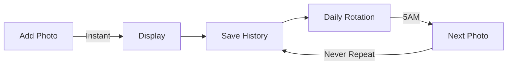

# 🖼️ Inky Photo Frame

<div align="center">

## 🖼️ Universal E-Ink Photo Frame • Auto-Detects Your Display

**Transform your Inky Impression into a stunning digital photo frame**

[](https://github.com/mehdi7129/inky-photo-frame)
[](LICENSE)
[](https://www.raspberrypi.org/)
[](https://shop.pimoroni.com/products/inky-impression-7-3)
[](https://shop.pimoroni.com/products/inky-impression-7-3?variant=55186435277179)

[**📥 Quick Install**](#-quick-installation) • [**📱 Phone Setup**](#-upload-photos-from-your-phone) • [**🔧 WiFi Config**](#-wifi-configuration) • [**📖 Full Guide**](INSTALLATION_GUIDE.md)

</div>

---

## 🎯 Compatible Displays

This project **automatically detects** and adapts to your Inky display:

| Model | Resolution | Aspect Ratio | Colors | Status |
|-------|------------|--------------|---------|---------|
| **Inky Impression 7.3"** | 800×480 | 5:3 | 7 colors | ✅ Fully Supported |
| **Inky Impression 7.3" (2025)** | 800×480 | 5:3 | 6 colors | ✅ Fully Supported |
| **Inky Impression 13.3" (2025)** | 1600×1200 | 4:3 | 6 colors | ✅ Fully Supported |

The software uses the official [Pimoroni Inky library](https://github.com/pimoroni/inky) with `inky.auto` for automatic display detection!

## ✨ What Makes It Special?

### 🎨 **Beautiful E-Ink Display**
- **Auto-adapts** to your display resolution
- **Multi-color** support (6-7 colors depending on model)
- **No backlight** - Easy on the eyes
- **Persistent** - Image stays without power

### 🔋 **Ultra Low Power**
- **0.6W average** - Less than an LED bulb
- **Zero power** when displaying
- **10x more efficient** than LCD frames
- **< 1€/year** electricity cost

## 📸 Features at a Glance

| Feature | Description |
|---------|------------|
| 📲 **Instant Display** | New photos appear immediately when added |
| 🔄 **Smart Rotation** | Daily change at 5AM with intelligent history |
| 🎨 **Color Modes** | 3 color profiles: calibrated palette, warm boost, or default |
| 📱 **Universal** | Works with iPhone, Android, any smartphone |
| 🖼️ **HEIC Support** | Native support for modern phone formats |
| ✂️ **Smart Cropping** | Automatic optimization for e-ink |
| 🎮 **Physical Buttons** | 4 buttons for navigation and color control |

## 🎮 Physical Button Controls

The Inky Impression has 4 physical buttons on the side for interactive control:

| Button | Location | Function |
|--------|----------|----------|
| **A** | Top | ⏭️ Next photo |
| **B** | | ⏮️ Previous photo |
| **C** | | 🎨 Cycle color modes (pimoroni → spectra_palette → warmth_boost) |
| **D** | Bottom | 🔄 Reset to pimoroni default mode |

**Features:**
- No messages displayed - actions happen silently
- Buttons are locked during photo display (~30-40s e-ink refresh)
- Color mode preference is saved and persists across reboots
- Navigate through your photo collection without using your phone

## 🚀 Quick Installation

### One-Line Install
```bash
curl -sSL https://raw.githubusercontent.com/mehdi7129/inky-photo-frame/main/install.sh | bash
```

That's it! The installer handles everything:
- ✅ Enables I2C and SPI (required for display)
- ✅ Dependencies
- ✅ SMB file sharing
- ✅ Auto-start on boot
- ✅ Disables all Raspberry Pi LEDs (no light pollution)

### 🔄 Update to Latest Version
```bash
inky-photo-frame update
```

## 📱 Upload Photos from Your Phone

### iPhone / iPad
1. Open **Files** app
2. Tap **Connect to Server**
3. Enter: `smb://[your-pi-ip]`
4. Login: `inky` / `[generated password shown on screen]`
5. Drop photos in **Images**

### Android
1. Install **CX File Explorer** or **Solid Explorer**
2. Add network location (SMB)
3. Enter: `smb://[your-pi-ip]`
4. Login: `inky` / `[generated password shown on screen]`
5. Upload to **Images**

## 🎯 How It Works

### Welcome Screen
When first powered on, the display shows:
- 📍 Your Raspberry Pi IP address
- 🔐 Login credentials (username: `inky` / password: randomly generated 10-char alphanumeric)
- 📝 Step-by-step instructions

**Security Note:** A unique random password is generated during installation and displayed on the screen. The password is stored in `$HOME/.inky_credentials` for persistence across reboots.

### Smart Photo Management


## 📶 WiFi Configuration

### How to change WiFi network:
1. **Power off** the Raspberry Pi
2. **Remove the SD card** and insert it into your computer
3. **Open the boot partition** (accessible on Windows/Mac/Linux)
4. **Edit** the file `wpa_supplicant.conf` (create it if it doesn't exist)
5. **Add your WiFi credentials**:
   ```
   country=US
   ctrl_interface=DIR=/var/run/wpa_supplicant GROUP=netdev
   update_config=1

   network={
       ssid="YourWiFiName"
       psk="YourWiFiPassword"
       key_mgmt=WPA-PSK
   }
   ```
6. **Save** the file, **eject** the SD card safely
7. **Re-insert** the SD card into the Pi and **power on**

The Pi will automatically connect to the new WiFi network on boot!

## 📦 What You Need

- **🖼️ Inky Impression Display** - Any model:
  - [Inky Impression 7.3"](https://shop.pimoroni.com/products/inky-impression-7-3)
  - [Inky Impression 7.3" (2025 Edition)](https://shop.pimoroni.com/products/inky-impression-7-3?variant=55186435244411))
  - [Inky Impression 13.3" (2025 Edition)](https://shop.pimoroni.com/products/inky-impression-7-3?variant=55186435277179))
- **🥧 Raspberry Pi** - Zero 2W, 3, 4, or 5
- **🔌 Power Supply** - 5V USB power
- **💾 SD Card** - 8GB+ recommended
- **📶 WiFi Network** - For photo uploads

## 🌟 Perfect For

- 🎁 **Personalized Gifts** - Load family photos before gifting
- 🏠 **Home Decoration** - Modern, minimalist design
- 👵 **Grandparents** - Simple to use, no tech knowledge needed
- 🌱 **Eco-Friendly** - Ultra-low power consumption
- 🎓 **Educational** - Learn about e-ink technology
- ⛺ **Portable/Outdoor** - Works on battery for weeks!

## 🔋 Battery Life & Power Consumption

### Power Usage Breakdown
| Component | Consumption | Notes |
|-----------|------------|-------|
| **Raspberry Pi Zero 2W** | 0.5-0.75W | Idle with WiFi |
| **E-ink Display Refresh** | 1W for 30s | Once per day |
| **Average Total** | **0.6W** | 24/7 operation |

### Estimated Battery Life
| Battery Capacity | Estimated Runtime | Usage Pattern |
|-----------------|-------------------|---------------|
| **10,000 mAh** | **~3-4 days** | WiFi always on, 1 change/day |
| **20,000 mAh** | **~7-8 days** | WiFi always on, 1 change/day |
| **26,800 mAh** | **~10-12 days** | WiFi always on, 1 change/day |
| **10,000 mAh** | **~30+ days** | WiFi off, pre-loaded photos |

*Note: E-ink displays consume ZERO power between refreshes!*

### Annual Cost Comparison
| Device | Power Usage | Annual Cost |
|--------|------------|-------------|
| **Inky Photo Frame** | 0.6W | < 1€ |
| iPad Photo Frame | 2-3W | ~4€ |
| LCD Digital Frame | 5-10W | ~13€ |
| LED Light Bulb | 7W | ~9€ |

## 🛠️ Advanced Configuration

### Change Photo Rotation Time
Edit `$HOME/inky-photo-frame/inky_photo_frame.py`:

```python
CHANGE_HOUR = 5  # Change daily at this hour (24h format)
PHOTOS_DIR = Path.home() / "Images"  # Photo storage location
```

### 🎨 Color Modes

**Choose the best color rendering for your photos!**

Edit `$HOME/inky-photo-frame/inky_photo_frame.py` and change `COLOR_MODE` (line 44):

#### **Mode 1: `spectra_palette`** ⭐ RECOMMENDED for Spectra 6
```python
COLOR_MODE = 'spectra_palette'
```
- Maps directly to the **6 calibrated Spectra colors**
- Uses measured RGB values: R=#a02020, Y=#f0e050, G=#608050, B=#5080b8
- Floyd-Steinberg dithering for smooth gradients
- **Best for**: Accurate, natural colors on Spectra displays

#### **Mode 2: `warmth_boost`** 🔥 For Warm Portraits
```python
COLOR_MODE = 'warmth_boost'
```
- Aggressive warmth enhancement
- RGB adjustments: Red +15%, Green -8%, Blue -25%
- Brightness +12%, Saturation 0.3
- **Best for**: Portraits, skin tones, warm family photos

#### **Mode 3: `pimoroni`** 🔵 Official Defaults (100% Faithful)
```python
COLOR_MODE = 'pimoroni'
```
- Official Pimoroni settings (exactly matches library behavior)
- Saturation 0.5, NO image processing
- Lets the Inky library handle everything internally
- **Best for**: General use, Classic 7.3" (7-color) displays

**How to apply:**
```bash
# 1. Edit the file
nano "$HOME/inky-photo-frame/inky_photo_frame.py"

# 2. Change COLOR_MODE on line 44

# 3. Restart the service
sudo systemctl restart inky-photo-frame
```

💡 **Tip**: Try all 3 modes to see which renders your photos best!

## ⚠️ Troubleshooting

### Display not working?
```bash
# Check if I2C and SPI are enabled
ls /dev/i2c* /dev/spidev*

# If not found, enable them:
sudo raspi-config nonint do_i2c 0
sudo raspi-config nonint do_spi 0
sudo reboot
```

## 📝 Commands

```bash
# Check status
sudo systemctl status inky-photo-frame

# View logs
sudo journalctl -u inky-photo-frame -f

# Restart service
sudo systemctl restart inky-photo-frame

# Manual test
"$HOME/inky-photo-frame/.venv/bin/python" "$HOME/inky-photo-frame/inky_photo_frame.py"
```

## 🤝 Contributing

Contributions are welcome! Feel free to:
- ⭐ Star this repo
- 🐛 Report bugs
- 💡 Suggest features
- 🔀 Submit pull requests

## 📄 License

MIT License - Feel free to use and modify!

## 🙏 Acknowledgments

- [Pimoroni](https://pimoroni.com) for the amazing Inky display
- Built with ❤️ for the Raspberry Pi community
- Powered by Python and e-ink technology

---

<div align="center">

**Created by [mehdi7129](https://github.com/mehdi7129)**

[⬆ Back to top](#️-inky-photo-frame)

</div>
